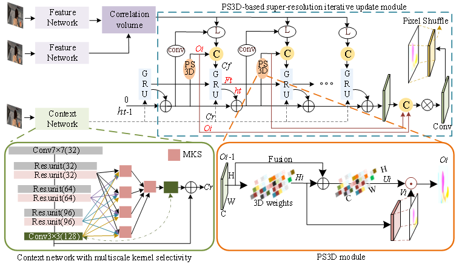

# RAFT
This repository contains the source code for our paper:

[Enhanced Optical Flow Estimation via  bMultiscale Kernel Selection and Super-Resolution Integration]<br/>



## Requirements
The code has been tested with PyTorch 1.6 and Cuda 10.1.
```Shell
conda create --name PS3D
conda activate PS3D
conda install pytorch=1.6.0 torchvision=0.7.0 cudatoolkit=10.1 matplotlib tensorboard scipy opencv -c pytorch

```

## Required Data
To evaluate/train RAFT, you will need to download the required datasets. 
* [FlyingChairs](https://lmb.informatik.uni-freiburg.de/resources/datasets/FlyingChairs.en.html#flyingchairs)
* [FlyingThings3D](https://lmb.informatik.uni-freiburg.de/resources/datasets/SceneFlowDatasets.en.html)
* [Sintel](http://sintel.is.tue.mpg.de/)
* [KITTI](http://www.cvlibs.net/datasets/kitti/eval_scene_flow.php?benchmark=flow)
* [HD1K](http://hci-benchmark.iwr.uni-heidelberg.de/) (optional)


By default `datasets.py` will search for the datasets in these locations. You can create symbolic links to wherever the datasets were downloaded in the `datasets` folder

```Shell
├── datasets
    ├── Sintel
        ├── test
        ├── training
    ├── KITTI
        ├── testing
        ├── training
        ├── devkit
    ├── FlyingChairs_release
        ├── data
    ├── FlyingThings3D
        ├── frames_cleanpass
        ├── frames_finalpass
        ├── optical_flow
```

## Evaluation
You can evaluate a trained model using `evaluate.py`
```Shell
python evaluate.py --model=models/raft-things.pth --dataset=sintel --mixed_precision
```

## Training
We used the following training schedule in our paper (2 GPUs). Training logs will be written to the `runs` which can be visualized using tensorboard
```Shell
./train_standard.sh
```

If you have a RTX GPU, training can be accelerated using mixed precision. You can expect similiar results in this setting (1 GPU)
```Shell
./train_mixed.sh
```

## (Optional) Efficent Implementation
You can optionally use our alternate (efficent) implementation by compiling the provided cuda extension
```Shell
cd alt_cuda_corr && python setup.py install && cd ..
```
and running `demo.py` and `evaluate.py` with the `--alternate_corr` flag Note, this implementation is somewhat slower than all-pairs, but uses significantly less GPU memory during the forward pass.
